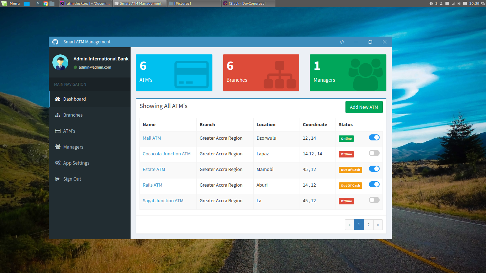

<p align="center">
  <h1 align="center">Smart ATM Manager - (Banks Version)</h1>
  <p align="center">Cross platform desktop app for banks useful for managing atms, reports and managers built by
<a href="https://codekeyz.netlify.com">Precious Keyz</a></p>
</p>

<p align="center">

</p>
 
## Installation

Clone the repo

```bash
git clone https://github.com/codekeyz/atm-desktop
```

Install Node Modules

```bash
cd atm-desktop && npm install
```

Run the project

```bash
npm run electron:local
```

## Usage

Use the following credentials to signin and test the application

__email__: admin@admin.com
__password__:  admin12345

## Included Commands

|Command|Description|
|--|--|
|`npm run electron:local`| Builds your application and start electron
|`npm run electron:linux`| Builds your application and creates an app consumable on linux system |
|`npm run electron:windows`| On a Windows OS, builds your application and creates an app consumable in windows 32/64 bit systems |
|`npm run electron:mac`|  On a MAC OS, builds your application and generates a `.app` file of your application that can be run on Mac |

## Contributing

All feedback and suggestions are welcome, just post an issue!

## Author

[Precious Keyz](https://codekeyz.netlify.com/)

License

---

MIT
